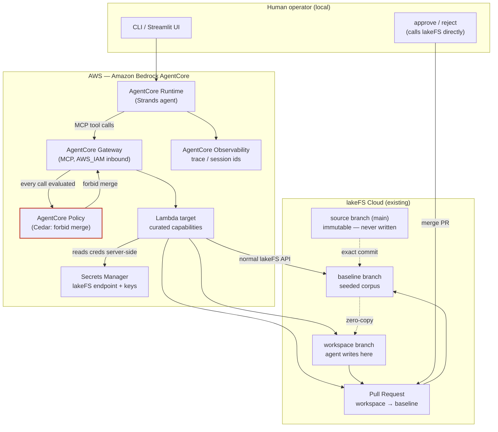

# Agentic Data PRs with Amazon Bedrock AgentCore and lakeFS Cloud

> **This sample connects to an existing lakeFS Cloud installation. Supply your
> endpoint and access keys, select an existing repository, and run the demo. It
> does not deploy or configure lakeFS.**

An autonomous curation agent, hosted on Amazon Bedrock AgentCore, is given a
messy synthetic support corpus and asked to produce a clean, approved, US-only
corpus. It works only through a narrow set of curated lakeFS operations exposed
by an AgentCore Gateway, it can write only to its own workspace branch, and it is
**forbidden from merging its own changes**. It opens a real lakeFS Cloud Pull
Request and stops. A human reviews the data diff and validation results and
merges separately.

> **AgentCore governs what the agent is allowed to do.
> lakeFS governs what happens to the data it changes.**

> **Verified live.** This sample was run end-to-end against a real lakeFS Cloud
> installation and real AWS Amazon Bedrock AgentCore (Gateway + Policy + Lambda +
> Runtime). A Claude agent on AgentCore Runtime curated the corpus through the
> curated Gateway tools, deterministic validation passed, a real lakeFS Pull
> Request was created, the Cedar policy **denied the merge** to the agent
> identity, the human-approval preflight passed, and the source branch stayed
> unchanged. See *Model access* and *Troubleshooting* for the two real-world
> gotchas (Anthropic model enablement and one lakeFS build's PR-merge endpoint).

## Better together

| Concern | Owned by | How |
|---|---|---|
| *What is the agent allowed to invoke?* | **AgentCore Policy (Cedar)** | Default-deny + forbid-wins; merge is explicitly denied to the agent identity. |
| *What tools even exist for the agent?* | **AgentCore Gateway** | Only 11 curated, input-validated capabilities are exposed as MCP tools (plus `merge`, which exists solely so Policy can deny it). |
| *Where can the agent write?* | **lakeFS branches** | A disposable, zero-copy workspace branch derived from an immutable baseline. |
| *What changed, and is it correct?* | **lakeFS diff + deterministic validation** | Structured diff + fail-closed validation the agent cannot override. |
| *Who approves the change?* | **A human + lakeFS Pull Request** | A separate local approval tool merges via the lakeFS PR API. |

## What this demo proves

1. An AgentCore agent receives a data-curation task.
2. lakeFS gives the agent a **zero-copy branch derived from an immutable source**.
3. The agent reads and modifies data **only on its assigned branch**.
4. AgentCore **Gateway** exposes a curated set of lakeFS operations.
5. AgentCore **Policy** prevents the autonomous agent from merging its changes.
6. The agent creates a **real lakeFS Cloud Pull Request**.
7. A human reviews the data diff and validation results.
8. A separate human approval action merges the Pull Request.
9. The original production branch is **completely unchanged** — the demo uses
   disposable baseline and workspace branches.

## Architecture



The agent never receives lakeFS credentials. The Lambda loads them from Secrets
Manager server-side and redacts them from logs. All authorization scope
(repository, branches, prefixes) is derived from **server-controlled run state**,
never from tool arguments the model supplies.

## The demo use case

A synthetic enterprise support corpus is seeded with deterministic problem cases:
a valid approved US doc, a doc for another region, a draft, a doc missing
classification, two duplicates, two conflicting versions, a superseded doc, a doc
containing a **synthetic** PII marker, a doc missing a title/product id, a doc
needing safe metadata normalisation, a restricted doc, and a clean doc. There is
**no real PII** — only markers like `SYNTHETIC_PII` and
`demo.user@example.invalid`.

The agent's task:

> Prepare an approved US support corpus from the supplied data. Identify missing
> metadata, duplicates, conflicting or superseded versions, drafts, non-US
> documents, and synthetic PII. Create a curated corpus, quarantine anything that
> fails policy, produce a complete report, validate the result, and create a Data
> Pull Request. Do not modify or merge into the source branch.

## Prerequisites

- Python 3.11+
- An **existing lakeFS Cloud** installation, an access key pair, and access to at
  least one repository with a source branch (default `main`).
- An AWS account with Amazon Bedrock AgentCore available in your region, and
  Bedrock model access for your chosen `BEDROCK_MODEL_ID` (see *Model access*).
- The AgentCore CLI for the Runtime step — it ships in the starter toolkit and
  provides the `agentcore` command:
  `pip install bedrock-agentcore-starter-toolkit` (ensure your user-scripts dir
  is on `PATH`). `direct_code_deploy` (used here) needs no Docker.

### Model access (Bedrock)

The old "Model access" console page is retired; serverless models auto-enable on
first invoke. The one exception is **Anthropic (Claude)**: a first-time account
must submit a one-time **use-case details form**. The simplest way to clear it:
open the target Claude model in the Bedrock **Model catalog → Playground** and
send one message — the console prompts the form there. After that, `Converse`/
`InvokeModel` (and this demo) work.

**Model choice matters for this demo.** The curation is a multi-tool, exact-JSON
workflow. **Claude is strongly recommended** — it handles streaming tool use
reliably. Amazon Nova and Llama are usable but need `AGENT_STREAMING=false`
(they don't support streaming tool use), and are less reliable at tool use in
general; the built-in `plan_curation` tool (below) exists partly to help weaker
models still produce a valid result.

### Required AWS permissions

To deploy: `secretsmanager:CreateSecret/DeleteSecret/GetSecretValue`,
`iam:CreateRole/PutRolePolicy/DeleteRole/DeleteRolePolicy/PassRole`,
`lambda:CreateFunction/DeleteFunction/AddPermission`, `logs:*` (scoped to the
demo log groups), `bedrock-agentcore:*` for the created Gateway/Target/Policy/
Runtime, and `bedrock:InvokeModel`. All created resources are prefixed
`agentcore-data-pr-<run-id>`. The sample does not request account-wide destructive
permissions.

The **agent runtime execution role** (`agentcore-data-pr-<run-id>-agent`) is
created by the deploy with the specific permissions the Runtime + Gateway need,
learned from live runs: `bedrock:InvokeModel`; the AgentCore gateway/policy
actions `InvokeGateway`, `GetPolicyEngine`, `GetPolicy`, `ListPolicies`,
`AuthorizeAction`/`PartiallyAuthorizeActions`/`BatchAuthorizeActions` (the Cedar
evaluation entrypoint); workload identity (`GetWorkloadAccessToken*`) and memory
actions; CloudWatch Logs + X-Ray for observability; and `lambda:InvokeFunction`
on the capability Lambda. Missing any of these makes the Runtime return an opaque
`500`, so they are provisioned up front.

### Required lakeFS Cloud key permissions

The supplied key pair needs, **within the selected repository only**: list
repositories, read/create/delete branches, list/read/write objects, commit, diff,
and the Pull Request APIs (create/get/update/merge). No storage-namespace or
backing-bucket access is needed or used.

## Configuration

```bash
cd 01_standalone_examples/agentcore/usecases/01-agentic-data-pr-lakefs-cloud
make configure
```

`make configure` asks for the lakeFS endpoint and access key id, reads the secret
key **without echo**, validates authentication, lists accessible repositories,
auto-selects when there is exactly one (or prompts when there are several), asks
for the source branch (default `main`), and writes a gitignored `.env` (mode
`600`). It never prints the secret key.

Non-interactive: set the environment variables from `.env.example` and run
`make configure` (it validates and rewrites `.env` without prompting).

| Variable | Required | Purpose |
|---|---|---|
| `LAKEFS_ENDPOINT` | yes | lakeFS Cloud base URL |
| `LAKEFS_ACCESS_KEY_ID` | yes | lakeFS access key id |
| `LAKEFS_SECRET_ACCESS_KEY` | yes | lakeFS secret (never printed / committed) |
| `LAKEFS_REPOSITORY` | no | pin the repository; otherwise selected/asked |
| `LAKEFS_SOURCE_BRANCH` | no | source branch, default `main` |
| `AWS_PROFILE` | no | when the default credential chain isn't enough |
| `AWS_REGION` | yes | region for AgentCore/Lambda/Secrets |
| `BEDROCK_MODEL_ID` | yes | model the agent reasons with (a Claude inference profile is recommended) |
| `AGENT_STREAMING` | no | `true` (default) for Claude; set `false` for Nova/Llama, which don't support streaming tool use |
| `AGENTCORE_RESOURCE_PREFIX` | no | AWS resource prefix, default `agentcore-data-pr` |

## Repository selection

On startup the sample validates the endpoint + credentials, lists accessible
repositories, verifies `LAKEFS_REPOSITORY` if set, auto-selects a single
repository, prompts when several are available, and stops with a clear message
if none are: *"No accessible lakeFS repositories were found…"*. It never creates
or deletes a repository.

## Running the demo

```bash
make setup                 # venv + locked deps + local packages
make check                 # verify AWS, Bedrock, lakeFS, repo, branches, APIs
make deploy                # provision the AgentCore stack (AWS)
make seed                  # disposable baseline + workspace branches + corpus
make run                   # invoke the deployed AgentCore agent
make test-policy-denial    # prove Policy denies merge (live Gateway call)
make show-pr PR_ID=<id>    # review status, diff, validation, review URL
make approve PR_ID=<id>    # human approval merges the PR
make cleanup               # tear down everything this run created
```

### Without deploying AgentCore

To demonstrate the full **lakeFS** Pull Request flow (seed → curate → validate →
PR → approve) without AWS/Bedrock, use the deterministic local runner:

```bash
make seed
make run-local             # same curated capabilities, run server-side, no LLM
make show-pr PR_ID=<id>
make approve PR_ID=<id>
make cleanup
```

This is explicitly *not the agent* — it exercises the identical curated
capabilities and validation deterministically so the lakeFS behaviour is
predictable and testable.

### Streamlit demo

```bash
make demo
```

The UI shows the connected endpoint (no credentials), the repository, the
source/baseline/workspace branches and commits, the task, the current stage,
discovered objects, curation decisions, commit ids, validation results, the data
diff, the policy-denial context, the Pull Request id and link, Approve/Reject
buttons with confirmation, the AgentCore trace id, and the final source-branch
integrity check. It calls the same `orchestrator` functions as the CLI and never
displays credentials, auth headers, secret ARNs, or signed URLs.

## Policy-denial demonstration

`make test-policy-denial` uses the **same identity as the agent** to call
`merge_data_pull_request` directly through the AgentCore Gateway and captures the
real AgentCore Policy (Cedar) denial. The denial is never faked in the prompt,
the Lambda, or the UI. If the forbidden capability is hidden from `tools/list`,
the test makes a direct Gateway call and verifies the refusal anyway.

## Pull Request review and human approval

The Pull Request goes **workspace → baseline** (never `main`). `make approve`
runs entirely against lakeFS Cloud directly (not the Gateway): it verifies the PR
belongs to this run, checks the source/destination branches, detects a race
(workspace HEAD must equal the validated commit), **re-runs deterministic
validation**, shows the diff, requires explicit confirmation, merges via the PR
API, and verifies the baseline changed while the **source branch did not**.
`make reject PR_ID=<id>` closes the PR without merging.

## Expected demo output

The seeded corpus has 15 objects. A correct run yields:

- **5 curated** documents (1 of them safely corrected), under
  `…/output/curated/us/`
- **10 quarantined** documents, each with a reason code, in
  `…/output/quarantine/manifest.json`
- Reports under `…/output/reports/` (`curation-report.json`, `-.md`,
  `validation-results.json`)
- Reconciliation that balances: `curated + quarantined == examined`
- A Pull Request `workspace → baseline`, validation **PASSED**
- Source branch HEAD **unchanged**

Every curated record carries complete provenance: source repository, branch,
commit, original path, original content hash, AgentCore session id, trace id,
action taken, and processing timestamp.

## Security model

- The **model never receives lakeFS credentials**. They live in Secrets Manager;
  only the Lambda role can read them; the Lambda loads them server-side and
  redacts them from logs.
- **Authorization is server-controlled.** The Gateway Lambda derives the allowed
  repository, branches, and prefixes from run state, not from tool arguments.
  Input validation rejects protected-branch writes, out-of-prefix access, path
  traversal, oversized objects, and unsupported content types.
- **Least privilege.** IAM roles grant only what the Lambda and Runtime need.
- **Defence in depth.** Even if the Cedar policy were misconfigured, the Lambda
  refuses to merge through the agent Gateway.
- **All data access is via the lakeFS Cloud API** — no physical bucket access, no
  S3 credentials, no lakeFS Mount, no `lakectl local`, no Metadata Search, no
  local mirror.

## AWS cost considerations

Costs are minimal and short-lived: one small Lambda (256 MB, sub-second calls),
one Secrets Manager secret, an AgentCore Gateway/Policy/Runtime for the duration
of the demo, a handful of Bedrock model invocations, and CloudWatch logs.
`make cleanup` deletes all of it. Run cleanup promptly to avoid idle charges on
the Runtime.

## Testing

```bash
make test        # unit tests (fast, no network)
make test-live   # opt-in live integration tests (require live lakeFS/AWS)
```

Unit tests cover repository selection, branch/prefix naming, prefix and traversal
enforcement, size/content-type limits, secret redaction, session-to-workspace
ownership, curation rules, duplicate and conflicting-version resolution, synthetic
PII rejection, provenance, report reconciliation, PR target validation, approval
race detection, and cleanup scoping. Live integration tests (marker `live`) are
**deselected by default**; enable with `RUN_LIVE_LAKEFS=1` / `RUN_LIVE_AGENTCORE=1`.

## Cleanup

`make cleanup` closes an unmerged PR, deletes the workspace and baseline branches,
deletes the Secrets Manager secret, and deletes the AgentCore Runtime, Gateway,
Target, Policy engine, Memory store, Lambda, IAM, and log resources it created —
walking the run-state manifest so even a partial deploy is torn down. It
**preserves** the repository, the source branch, and everything outside the run
namespace, verifies the source HEAD is unchanged, and reports anything it could
not delete. lakeFS retains closed/merged PR history as audit record; that is
intentional.

It is safe to re-run: already-deleted resources count as success, and parent
deletes retry while their children finish tearing down (the AgentCore control
plane is asynchronous, so a Gateway can briefly still report the Target you just
deleted). The Memory store is created by the `agentcore` CLI rather than by
`make deploy`, so it is matched by run id instead of the resource manifest.

After cleanup, confirm nothing is left:

```bash
aws bedrock-agentcore-control list-agent-runtimes --region "$AWS_REGION"
aws bedrock-agentcore-control list-gateways      --region "$AWS_REGION"
aws bedrock-agentcore-control list-policy-engines --region "$AWS_REGION"
aws bedrock-agentcore-control list-memories      --region "$AWS_REGION"
```

## Troubleshooting

| Symptom | Fix |
|---|---|
| `Missing required lakeFS configuration` | Run `make configure` or set the `LAKEFS_*` vars. |
| `No accessible lakeFS repositories were found` | Get access to a repository in lakeFS Cloud. |
| `Multiple repositories are accessible` | Set `LAKEFS_REPOSITORY` or run interactively. |
| Deploy warns the Runtime didn't launch | Install the AgentCore CLI (`pip install bedrock-agentcore-starter-toolkit`) and ensure `agentcore` is on `PATH`; Gateway/Lambda/Policy are still deployed. Use `make run-local` meanwhile. |
| `pull request APIs available` check fails | Confirm your lakeFS Cloud plan exposes the Pull Request API and your key can use it. |
| `ResourceNotFoundException … use case details have not been submitted` | First-time Anthropic use — submit the use-case form via Bedrock **Model catalog → Playground** (see *Model access*). Not a code error. |
| Runtime returns `500` with no logs | The runtime execution role is missing permissions (logs/x-ray/workload/`AuthorizeAction`) — the current deploy provisions these; if you customized the role, re-add them. |
| `Model produced invalid sequence as part of ToolUse` / `doesn't support tool use in streaming mode` | Non-Claude model tool-use limitation. Set `AGENT_STREAMING=false`; prefer Claude for reliable tool use. |
| `make cleanup` reports `AccessDeniedException … DeleteAgentRuntime` | AgentCore answers `AccessDenied` (not `ResourceNotFound`) for a runtime id that doesn't exist, so this usually means the recorded id is wrong, not that a permission is missing. Confirm with `aws bedrock-agentcore-control list-agent-runtimes`; if the runtime is already gone, cleanup now skips it. |
| `make approve` fails at merge with `404 invalid API endpoint` | Some lakeFS Cloud builds expose PR merge on a different route than `POST /pulls/{id}/merge`. The approval preflight (ownership + re-validation + diff) still runs; merge via the lakeFS UI, or adjust `LakeFSClient.merge_pull_request` to your build's endpoint. |

## Directory layout

```
01-agentic-data-pr-lakefs-cloud/
├── agent/          Strands agent + system prompt (AgentCore Runtime entrypoint)
├── gateway/        Lambda handler, lakeFS client, input validation, tool schemas
├── policy/         Cedar policy + authorization model + tests
├── curation/       Deterministic rules, fail-closed validator, reports
├── seed/           Synthetic corpus + independent expected-results.json
├── common/         Config, run-scope naming, run-state, provenance, redaction
├── orchestrator/   Shared business logic (used by both CLI and UI)
├── scripts/        CLI entrypoints (configure/check/deploy/seed/run/...)
├── ui/             Streamlit demo
├── tests/          Unit tests + opt-in live integration tests
├── requirements.txt  Runtime deps bundled into the AgentCore Runtime agent
└── generated/      Per-run state + resource manifests (gitignored)
```
