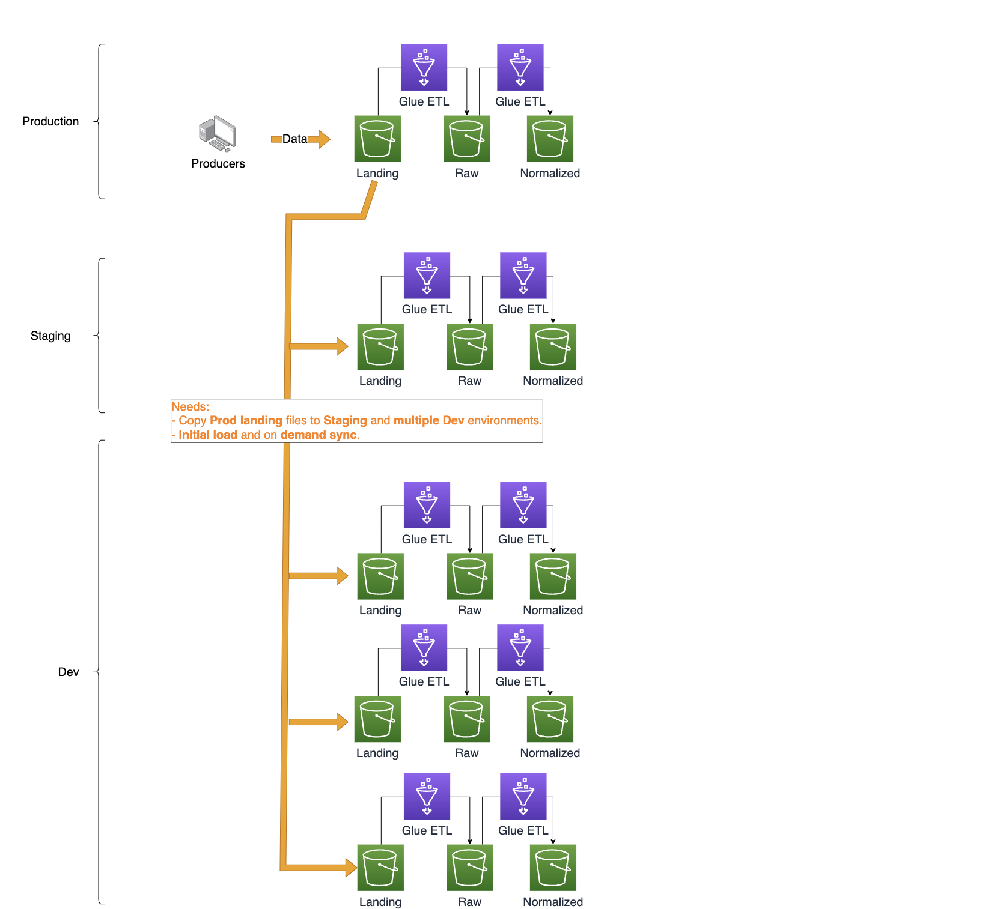

# Integration of lakeFS with Glue Catalog and Athena

Start by ⭐️ starring [lakeFS open source](https://go.lakefs.io/oreilly-course) project.

This repository includes following Glue jobs:

1. glue-athena-demo-notebook:
* Use Case: Isolated Dev/Test Environments
* This interactive notebook demonstrate integration of lakeFS with [Glue Catalog](https://docs.lakefs.io/integrations/glue_hive_metastore.html) and [Athena](https://docs.lakefs.io/integrations/athena.html). 

2. glue-lakefs-demo:
* Use Case: Version Control of multi-buckets pipelines
* In data engineering pipelines, it is common to have distinct buckets that serve different purposes. These buckets are typically named and categorized based on their respective stages in the data processing pipeline. When implementing lakeFS, it may be necessary to maintain separate physical buckets for each stage. However, it is important to version control all changes made to each bucket and link between different versions to track the evolution of the data through the pipeline. This image explains this use case:

## Prerequisites
* lakeFS installed and running in your AWS environment or in the lakeFS Cloud. If you don't have lakeFS already running then either use [lakeFS Cloud](https://lakefs.cloud/) which provides free lakeFS server on-demand with a single click or [Deploy lakeFS on AWS](https://docs.lakefs.io/howto/deploy/aws.html) doc.

## Setup

Download these programs from GitHub and import it in your AWS Glue Studio:
1. glue-athena-demo-notebook:
* Upload this as a Jupyter notebook in your AWS Glue Studio.

2. glue-lakefs-demo:
* Upload this Python program as a Spark Script in your AWS Glue Studio. Also, add following Job Parameters under Job Details:

      --additional-python-modules  lakefs-client

## Demo Instructions

1. glue-athena-demo-notebook:
* Open this notebook in Glue Studio and follow the instructions.

2. glue-lakefs-demo:
* Open this job in Glue Studio. Change lakeFS credentials, repo and production branch name in the first few lines and run the job.
