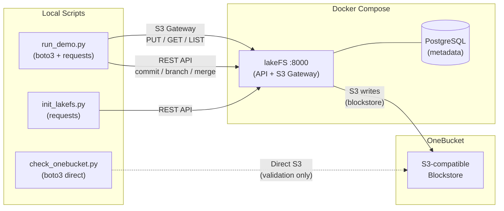

# lakeFS + OneBucket demo

A reproducible local demo that runs lakeFS end-to-end against
[OneBucket by Attimis](https://onebucket.io) as its S3-compatible blockstore.

lakeFS runs locally in Docker (with PostgreSQL as its metadata store) and writes all
of its blockstore objects to OneBucket over the S3 API. The same configuration applies
to any S3-compatible object store — OneBucket is the one exercised here.

> **Security note:** Never commit `.env`. It is in `.gitignore`. Only `.env.example`
> (which contains placeholder values) is committed.

---

## What this demo proves

```
Client scripts → lakeFS API/S3 Gateway → lakeFS metadata (Postgres) + OneBucket blockstore
```

- **All demo data flows through lakeFS**, not directly to OneBucket.
- lakeFS stores its data blocks and metadata manifests in OneBucket automatically.
- The demo exercises branch, commit, and (optionally) merge — the core lakeFS versioning
  primitives — while the underlying storage is OneBucket.

---

## Architecture



`check_onebucket.py` is the **only** script that writes directly to OneBucket.
It is a pre-flight connectivity check and cleans up after itself.

---

## Prerequisites

| Tool | Version |
|---|---|
| Docker + Docker Compose | any recent |
| Python | 3.11+ |
| `make` | any |

You will need:
- OneBucket S3-compatible endpoint URL (with `https://` or `http://`)
- OneBucket access key and secret key
- An existing OneBucket bucket
- (Optional) region string — `us-east-1` works for most S3-compatible endpoints

---

## Quick start

```bash
git clone https://github.com/treeverse/lakeFS-samples.git
cd lakeFS-samples/01_standalone_examples/lakefs-onebucket
cp .env.example .env
# edit .env  ← fill in your OneBucket credentials
make setup
make check-onebucket
make up
make init
make demo
```

---

## Step-by-step setup

### 1. Clone and copy the env file

```bash
cp .env.example .env
```

**Never commit `.env`** — it is excluded by `.gitignore`.

### 2. Configure OneBucket credentials

Open `.env` and fill in the OneBucket section:

```dotenv
ONEBUCKET_ENDPOINT=https://your-onebucket-endpoint.example.com
ONEBUCKET_ACCESS_KEY_ID=your-access-key
ONEBUCKET_SECRET_ACCESS_KEY=your-secret-key
ONEBUCKET_BUCKET=your-bucket-name
ONEBUCKET_REGION=us-east-1
ONEBUCKET_FORCE_PATH_STYLE=true     # keep true — required for most S3-compatible stores
ONEBUCKET_SKIP_VERIFY=false         # set true if OneBucket uses a self-signed cert
```

> **Important:** Put only the hostname (and port if needed) in `ONEBUCKET_ENDPOINT`.
> Do not include the bucket name in the endpoint URL.

### 3. Configure lakeFS credentials

Still in `.env`, set the lakeFS admin credentials. These will be created automatically
on first container start. Choose any non-empty values:

```dotenv
LAKEFS_ACCESS_KEY_ID=your-lakefs-admin-key
LAKEFS_SECRET_ACCESS_KEY=your-lakefs-admin-secret
```

Generate the required secret keys:

```bash
openssl rand -hex 32   # use the output for LAKEFS_AUTH_ENCRYPT_SECRET_KEY
openssl rand -hex 32   # use the output for LAKEFS_BLOCKSTORE_SIGNING_SECRET_KEY
```

### 4. Choose the storage namespace

`LAKEFS_STORAGE_NAMESPACE` controls where lakeFS writes its blockstore objects inside
the OneBucket bucket. It must start with `s3://`.

You can use any valid path:

```dotenv
# Recommended: use a prefix to isolate lakeFS data
LAKEFS_STORAGE_NAMESPACE=s3://my-bucket/lakefs/onebucket-demo/

# Other valid options:
# LAKEFS_STORAGE_NAMESPACE=s3://my-bucket/
# LAKEFS_STORAGE_NAMESPACE=s3://my-bucket/demos/experiment1/
```

If `LAKEFS_STORAGE_NAMESPACE` is empty, `make init` derives a safe default:
```
s3://<ONEBUCKET_BUCKET>/lakefs/<LAKEFS_REPO>/
```

### 5. Install Python dependencies

```bash
make setup
```

This creates `.venv/` and installs `requirements.txt`.

### 6. Validate OneBucket connectivity

```bash
make check-onebucket
```

This runs `scripts/check_onebucket.py`, which:
- Validates endpoint format and credentials
- Does a HeadBucket to confirm bucket access
- Writes, reads, and deletes a test object under `_lakefs_demo_connectivity_check/`
- Prints actionable diagnostics if anything fails

Fix any errors before proceeding. See [docs/troubleshooting.md](docs/troubleshooting.md).

### 7. Start lakeFS

```bash
make up
```

This starts two containers:
- **postgres** — lakeFS metadata store
- **lakefs** — lakeFS server (API + S3 Gateway), mapped to `http://localhost:8000`

On first start, the lakeFS container runs `lakefs setup` automatically, creating the
admin user from the `LAKEFS_ACCESS_KEY_ID` and `LAKEFS_SECRET_ACCESS_KEY` in your `.env`.
Later starts detect that setup is already complete and skip it.

Watch startup logs: `make logs`

The lakeFS UI is at **http://localhost:8000** when ready.

### 8. Initialize the lakeFS repository

```bash
make init
```

This runs `scripts/init_lakefs.py`, which:
- Waits for lakeFS to be healthy and accepts authentication
- Creates (or validates) the repository

**Auto-create mode** (default, `CREATE_LAKEFS_REPO=true`):
- Creates the repository named `LAKEFS_REPO` with storage namespace `LAKEFS_STORAGE_NAMESPACE`
- Idempotent — safe to re-run; skips creation if the repository already exists

**Existing-repo mode** (`CREATE_LAKEFS_REPO=false`):
- Does **not** create a repository
- Validates that `LAKEFS_REPO` exists in lakeFS
- Prints the detected repository info (name, storage namespace, default branch)
- Use this when you have created a repository manually via the UI or API

### 9. Run the demo

```bash
make demo
```

This runs `scripts/run_demo.py`, which uses **boto3 pointed at the lakeFS S3 Gateway**
(not directly at OneBucket) to demonstrate:

1. Upload `raw/customers.csv` to the `main` branch via lakeFS
2. Commit on `main`
3. Create an `experiment` branch
4. Upload `processed/customers_clean.csv` to `experiment` via lakeFS
5. Commit on `experiment`
6. *(Optional)* Merge `experiment` → `main` (set `MERGE_EXPERIMENT=true` in `.env`)
7. List objects on both branches
8. Read objects back

---

## Expected output

```
============================================================
  lakeFS + OneBucket demo
============================================================
  lakeFS endpoint:  http://localhost:8000
  Repository:       onebucket-demo
  Main branch:      main
  Merge experiment: false
============================================================

------------------------------------------------------------
[1] Writing object through lakeFS S3 Gateway:
    Bucket: onebucket-demo  Key: main/raw/customers.csv
    OK
------------------------------------------------------------
[2] Committing to 'main'...
    Commit ID: <commit-id>
------------------------------------------------------------
[3] Creating branch 'experiment' from 'main'...
    OK
------------------------------------------------------------
[4] Writing transformed object through lakeFS S3 Gateway:
    Bucket: onebucket-demo  Key: experiment/processed/customers_clean.csv
    OK
------------------------------------------------------------
[5] Committing to 'experiment'...
    Commit ID: <commit-id>
------------------------------------------------------------
[6] Skipping merge (set MERGE_EXPERIMENT=true in .env to enable)
------------------------------------------------------------
[7] Objects on 'main':
    raw/customers.csv

    Objects on 'experiment':
    raw/customers.csv
    processed/customers_clean.csv
------------------------------------------------------------
[8] Reading objects back...
    main/raw/customers.csv: 121 bytes — OK
    experiment/processed/customers_clean.csv: 110 bytes — OK
------------------------------------------------------------

============================================================
  Demo Summary
============================================================
  Repository:            onebucket-demo
  Main commit:           <commit-id>
  Experiment commit:     <commit-id>
  Objects on main:       1
  Objects on experiment: 2

  Demo completed successfully.

  lakeFS UI: http://localhost:8000/repositories/onebucket-demo/objects
============================================================
```

---

## Cleanup

Stop containers (preserve volumes and credentials):
```bash
make down
```

Full cleanup — stops containers, removes Docker volumes (Postgres data), and deletes `.venv`:
```bash
make clean
```

> `make clean` does **not** delete `.env` or anything in OneBucket.
> lakeFS blockstore objects in OneBucket must be cleaned up manually (or by deleting the
> bucket prefix defined in `LAKEFS_STORAGE_NAMESPACE`).

---

## Repository modes reference

| `.env` setting | `make init` behavior |
|---|---|
| `CREATE_LAKEFS_REPO=true` | Creates `LAKEFS_REPO` using `LAKEFS_STORAGE_NAMESPACE`. Idempotent. |
| `CREATE_LAKEFS_REPO=false` | Validates that `LAKEFS_REPO` exists. Prints its info. Fails if not found. |

---

## All Makefile targets

| Target | Description |
|---|---|
| `make setup` | Create `.venv` and install Python dependencies |
| `make check-onebucket` | Validate OneBucket endpoint/credentials/bucket |
| `make up` | Start lakeFS + Postgres in Docker |
| `make init` | Create or validate the lakeFS repository |
| `make demo` | Run the full demo workflow |
| `make logs` | Stream container logs (Ctrl-C to stop) |
| `make down` | Stop containers |
| `make clean` | Stop containers, remove volumes and `.venv` |

---

## Troubleshooting

See [docs/troubleshooting.md](docs/troubleshooting.md) for common issues including:

- TLS / self-signed certificate errors
- Port conflicts
- Authentication failures on first run
- boto3 checksum errors against the lakeFS S3 Gateway
- lakeFS blockstore write failures

---

## Configuring lakeFS against an S3-compatible store

See [docs/onebucket-notes.md](docs/onebucket-notes.md) for:

- Why path-style addressing is required
- TLS verification configuration
- Region handling for S3-compatible endpoints
- What lakeFS writes to the bucket (data blocks + metadata manifests)

### Key configuration decisions

| Setting | Value | Reason |
|---|---|---|
| `ONEBUCKET_FORCE_PATH_STYLE` | `true` | Required for S3-compatible stores without DNS wildcards |
| `LAKEFS_BLOCKSTORE_S3_STREAMINGCHUNKEDENCODING` | `false` | Some S3-compatible APIs reject AWS chunked encoding |
| boto3 checksum mode | `when_required` | Avoids checksum header conflicts with lakeFS S3 Gateway |
| lakeFS metadata | Postgres | More realistic than embedded; matches production deployments |

---

## File layout

```
.
├── .env.example              # Credential template — fill in and save as .env
├── .env                      # Your credentials — gitignored, never commit
├── .gitignore
├── Makefile
├── README.md
├── docker-compose.yml        # lakeFS + Postgres; reads credentials from .env
├── requirements.txt
├── scripts/
│   ├── check_onebucket.py    # Direct OneBucket connectivity validation
│   ├── init_lakefs.py        # lakeFS repository bootstrap / validation
│   └── run_demo.py           # Full demo workflow via lakeFS
└── docs/
    ├── troubleshooting.md
    └── onebucket-notes.md
```
