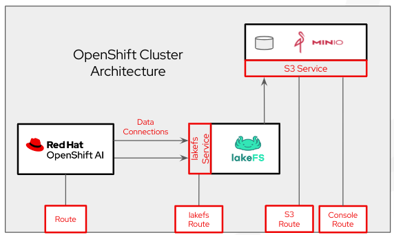

# Overview

[lakeFS](https://lakefs.io/) is a data versioning application that brings git-like versioning to object storage. It can interface with many object storage applications on the backend, and provide a S3 API gateway for object storage clients to connect to. In this demo, we'll configure OpenShift AI to connect over S3 interace to lakeFS, which will version the data in a backend [MinIO](https://min.io/docs/minio/kubernetes/openshift/index.html) instance.



# lakeFS with OpenShift AI Demo

The following steps should be followed to perform the [Fraud Detection demo](https://docs.redhat.com/en/documentation/red_hat_openshift_ai_self-managed/2-latest/html/openshift_ai_tutorial_-_fraud_detection_example/index) on OpenShift AI, with lakeFS used for object storage management.

## Prerequisites

1. Bring up [OpenShift cluster](https://docs.redhat.com/en/documentation/openshift_container_platform/4.17#Install)
2. Install [OpenShift Service Mesh](https://docs.openshift.com/container-platform/4.16/service_mesh/v2x/installing-ossm.html#ossm-install-ossm-operator_installing-ossm), [OpenShift Serverless](https://docs.openshift.com/serverless/1.34/install/install-serverless-operator.html) and [OpenShift Pipelines](https://docs.openshift.com/pipelines/1.16/install_config/installing-pipelines.html) on the OpenShift cluster
3. Install [OpenShift AI](https://docs.redhat.com/en/documentation/red_hat_openshift_ai_self-managed/2.13/html/installing_and_uninstalling_openshift_ai_self-managed/index) on the OpenShift cluster
4. Install the `oc` OpenShift [CLI client](https://docs.openshift.com/container-platform/4.16/cli_reference/openshift_cli/getting-started-cli.html) on a machine thas access to the cluster

## Deploy and Configure the Environment
From the client machine, authenticate the `oc` client.

```
oc login <cluster_api_url> -u kubeadmin -p <admin_pw>
```

### Create a `lakefs` project in OpenShift.

```
oc new-project lakefs
```

### Clone the lakeFS samples repo
Clone the [lakeFS-samples.git](https://github.com/treeverse/lakeFS-samples.git) repository and change into the newly created directory.

```
git clone https://github.com/treeverse/lakeFS-samples.git

cd lakeFS-samples/01_standalone_examples/red-hat-openshift-ai/cluster-configuration
```

### Deploy MinIO
Deploy MinIO in the `lakefs` project using the `minio-via-lakefs.yaml` file.

```
oc apply -f minio-via-lakefs.yaml
```
A random MinIO root user and password will be generated, stored in a `secret`, and used to populate MinIO with three storage buckets:
* **my-storage** 
* **pipeline-artifacts**
* **quickstart**


### Deploy lakeFS
Deploy lakeFS in the **lakefs** project using the `lakefs-minio.yaml` file. This yaml will not only deploy lakefs but also:
* connect it with MinIO buckets created earlier
* create two lakeFS repo:
  * **quickstart:** as a sample data repo
  * **my-storage** which is connected to backend my-storage s3 bucket created earlier


```
oc apply -f lakefs-minio.yaml
```

### Access lakeFS UI
You can now log into the OpenShift cluster's web console as a regular user (ie. developer). Follow the arrows in the screenshot below to find the lakeFS `route`, which provides external access to the lakeFS administrator. Use the lakeFS route to access the lakeFS UI.

For this demo, you will use the following credentials to access the lakeFS UI.

* **Access Key**: something
* **Secret Access Key**: simple

  

NOTES:
- You can also follow above steps, but click on MinIO in the topology, to find the `route` to access MinIO's console or S3 interface. MinIO access credentials can be found in the `minio-root-user` secret within the OpenShift web console when logged in as an admin user (ie. kubeadmin).

  - Switch to the **Administrator** persona using the drop-down at the top left
  - Expand the **Workloads** navigation
  - Click on **Secrets**
  - Filter for 'minio' name
  - Click on the **minio-root-user** secret
  - Scroll down and click on **Reveal values** to see the MinIO root user and password

- If you don't see the visual layout as shown in the screenshot, then click on the icon highlighted below to change the view.

  

### Access OpenShift AI Console
From the OpenShift web console, you can now open the OpenShift AI web console as shown below.


## Fraud Detection Demo

You may now run through the [Fraud Detection demo](https://docs.redhat.com/en/documentation/red_hat_openshift_ai_self-managed/2-latest/html/openshift_ai_tutorial_-_fraud_detection_example/index) in the new **lakefs** data science project. Refer to following notes for the different sections of this demo:

2.2. Setting up your data science project:
* Use the `lakefs` data science project for the demo. You do not need to create a new project.

2.3. Storing data with data connections:
* When going through the demo, follow the steps to manually configure the storage data connections. **Do not** follow steps that use a script to automate the MinIO storage deployment, configuration and data connections. 

2.3.1. Creating data connections to your own S3-compatible object storage:
* When creating "My Storage" data connection, use lakeFS access key ("something"), secret key ("simple"), endpoint ("http://my-lakefs"), region ("us-east-1") and bucket ("my-storage") instead of MinIO access key and endpoint:

  

* When creating "Pipeline Artifacts" data connection, use MinIO access key, secret key, endpoint (the route to access MinIO's S3 interface), region ("us-east-1") and bucket ("pipeline-artifacts"):

  

3.1. Creating a workbench and selecting a notebook image:
* While creating Workbench add environment variables to access lakeFS: 
  * LAKECTL_SERVER_ENDPOINT_URL = http://my-lakefs
  * LAKEFS_REPO_NAME = my-storage
  * LAKEFS_DEFAULT_REGION =us-east-1 
  * LAKECTL_CREDENTIALS_ACCESS_KEY_ID = something
  * LAKECTL_CREDENTIALS_SECRET_ACCESS_KEY = simple

  

3.2. Importing the tutorial files into the Jupyter environment:
* After cloning and selecting latest branch for the Fraud Detection tutorial repository (https://github.com/rh-aiservices-bu/fraud-detection.git), double-click the newly-created `fraud-detection` folder in the file browser and click on "Upload Files" icon:

  

* Select and upload tutorial notebooks changed for the lakeFS tutorial (ending with lakeFS) which are saved in `lakeFS-samples/red-hat-openshift-ai/fraud-detection` folder of `lakeFS-samples` repo (https://github.com/treeverse/lakeFS-samples.git):

  

* Double-click the `ray-scripts` subfolder inside `fraud-detection` folder in the file browser and click on "Upload Files" icon:

  

* Select and upload `train_tf_cpu_lakefs.py` changed for the lakeFS tutorial which is saved in `lakeFS-samples/red-hat-openshift-ai/fraud-detection/ray-scripts` folder of `lakeFS-samples` repo:

  

* After uploading `train_tf_cpu_lakefs.py` file, file browser will show two Python programs:

  

* Double-click the `pipeline` subfolder inside `fraud-detection` folder in the file browser and click on "Upload Files" icon:

  

* Select and upload `7_get_data_train_upload_lakefs.py` and `build_lakefs.sh` changed for the lakeFS tutorial which is saved in `lakeFS-samples/red-hat-openshift-ai/fraud-detection/pipeline` folder of `lakeFS-samples` repo:

  

3.4. Training a model:
* In your notebook environment, open the `1_experiment_train_lakefs.ipynb` file instead of `1_experiment_train.ipynb` and follow the instructions directly in the notebook. The instructions guide you through some simple data exploration, experimentation, and model training tasks.

4.1. Preparing a model for deployment:
* In your notebook environment, open the `2_save_model_lakefs.ipynb` file instead of `2_save_model.ipynb` and follow the instructions directly in the notebook.

4.2. Deploying a model:
* Use the lakeFS branch name in the path that leads to the version folder that contains your model file: `train01/models/fraud`:

  

4.3. Testing the model API:
* In your notebook environment, open the `3_rest_requests_multi_model_lakefs.ipynb` file instead of `3_rest_requests_multi_model.ipynb` and follow the instructions directly in the notebook.
* In your notebook environment, open the `4_grpc_requests_multi_model_lakefs.ipynb` file instead of `4_grpc_requests_multi_model.ipynb` and follow the instructions directly in the notebook.
* In your notebook environment, open the `5_rest_requests_single_model_lakefs.ipynb` file instead of `5_rest_requests_single_model.ipynb` and follow the instructions directly in the notebook.

5.1. Automating workflows with data science pipelines:
* Instead of creating Red Hat OpenShift AI pipeline from stratch, you can run already created pipeline called `6 Train Save lakefs.pipeline`. In your notebook environment, open `6 Train Save lakefs.pipeline` and click the play button in the toolbar of the pipeline editor to run the pipeline. If you want to create the pipeline from stratch then follow the tutorial instructions but make following changes in section 5.1.5:

5.1.5. Configure the data connection to the S3 storage bucket:
* Under Kubernetes Secrets, use the secret name for  `pipeline-artifacts` data connection for the following environment variables in **both nodes** of the pipeline:
  * AWS_ACCESS_KEY_ID
  * AWS_SECRET_ACCESS_KEY
  * AWS_S3_ENDPOINT
  * AWS_DEFAULT_REGION
  * AWS_S3_BUCKET

  

  

* Under Kubernetes Secrets, use the secret name for `my-storage` data connection when adding following lakeFS environment variables in **both nodes** of the pipeline: 
  * LAKECTL_SERVER_ENDPOINT_URL = AWS_S3_ENDPOINT
  * LAKECTL_CREDENTIALS_ACCESS_KEY_ID = AWS_ACCESS_KEY_ID
  * LAKECTL_CREDENTIALS_SECRET_ACCESS_KEY = AWS_SECRET_ACCESS_KEY
  * LAKEFS_REPO_NAME = AWS_S3_BUCKET
  * LAKEFS_DEFAULT_REGION =AWS_DEFAULT_REGION

  

  

5.2. Running a data science pipeline generated from Python code:
* Use `7_get_data_train_upload_lakefs.yaml` instead of `7_get_data_train_upload.yaml` when importing pipeline in OpenShift AI.

6.1. Distributing training jobs with Ray:
* In your notebook environment, open the `8_distributed_training_lakefs.ipynb` file instead of `8_distributed_training.ipynb`. Change MinIO Access and Secret keys in the 2nd code cell of the notebook and run the notebook.

  Optionally, if you want to view the Python code for this section, you can find it in the ray-scripts/train_tf_cpu_lakefs.py file.

See [lakeFS documentation](https://docs.lakefs.io/) and [MinIO documentation for OpenShift](https://min.io/docs/minio/kubernetes/openshift/index.html) for details.

# File Descriptions

- [lakefs-local.yaml](./cluster-configuration/lakefs-local.yaml): Bring up lakeFS using local object storage. This would be useful for a quick demo where MinIO is not included.
- [lakefs-minio.yaml](./cluster-configuration/lakefs-minio.yaml): Bring up lakeFS configured to use MinIO as backend object storage. This will be used in the lakeFS demo.
- [minio-direct.yaml](./cluster-configuration/minio-direct.yaml): This file would only be used if lakeFS is not in the picture and OpenShift AI will communicate directly with MinIO. It will bring up MinIO as it is in the default Fraud Detection demo, complete with configuring MinIO storage buckets and the OpenShift AI data connections. It may serve useful in debugging an issue.
- [minio-via-lakefs.yaml](./cluster-configuration/minio-via-lakefs.yaml): Bring up MinIO for the modified Fraud Detection demo that includes lakeFS, complete with configuring MinIO storage buckets, but do NOT configure the OpenShift AI data connections. This will be used in the lakeFS demo.
