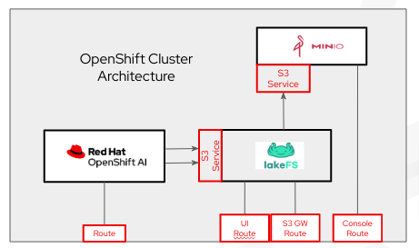

# Overview

[lakeFS](https://lakefs.io/) is a data versioning application that brings git-like versioning to object storage. It can interface with many object storage applications on the backend, and provide a S3 API gateway for object storage clients to connect to. In this demo, we'll configure OpenShift AI to connect over S3 interace to lakeFS, which will version the data in a backend [MinIO](https://min.io/docs/minio/kubernetes/openshift/index.html) instance.



# lakeFS with OpenShift AI Demo

The following steps should be followed to perform the [Fraud Detection demo](https://docs.redhat.com/en/documentation/red_hat_openshift_ai_self-managed/2.13/html/openshift_ai_tutorial_-_fraud_detection_example/index) on OpenShift AI, with lakeFS used for object storage management.

## Prerequisites

1. Bring up [OpenShift cluster](https://docs.redhat.com/en/documentation/openshift_container_platform/4.17#Install)
2. Install [OpenShift Service Mesh](https://docs.openshift.com/container-platform/4.16/service_mesh/v2x/installing-ossm.html#ossm-install-ossm-operator_installing-ossm), [OpenShift Serverless](https://docs.openshift.com/serverless/1.34/install/install-serverless-operator.html) and [OpenShift Pipelines](https://docs.openshift.com/pipelines/1.16/install_config/installing-pipelines.html) on the OpenShift cluster
3. Install [OpenShift AI](https://docs.redhat.com/en/documentation/red_hat_openshift_ai_self-managed/2.13/html/installing_and_uninstalling_openshift_ai_self-managed/index) on the OpenShift cluster
4. Install the `oc` OpenShift [CLI client](https://docs.openshift.com/container-platform/4.16/cli_reference/openshift_cli/getting-started-cli.html) on a machine thas access to the cluster

## Deploy the Workloads

1. From the client machine, authenticate the `oc` client.

```
oc login <cluster_api_url> -u kubeadmin -p <admin_pw>
```

2. Create a `lakefs` project in OpenShift.

```
oc new-project lakefs
```

3. Clone the 

```
git clone https://github.com/treeverse/lakeFS-samples.git

cd lakeFS-samples/01_standalone_examples/red-hat-openshift-ai/cluster-configuration
```

4. Deploy MinIO in the lakefs project using the `minio-via-lakefs.yaml` file.

```
oc apply -f minio-via-lakefs.yaml
```

5. Edit the `lakefs-minio.yaml` file to configure the MinIO access credentials. The values can be found in the `minio-root-user` secret within the OpenShift web console when logged in as an admin user.

```
blockstore:
      type: s3
      s3:
        force_path_style: true
        endpoint: https://minio:9000
        discover_bucket_region: false
        credentials:
          access_key_id: MINIO_ROOT_USER
          secret_access_key: MINIO_ROOT_USER_PASSWORD
```

6. Deploy lakeFS in the lakefs project using the `lakefs-minio.yaml` file.

```
oc apply -f lakefs-minio.yaml
```

7. Configure OpenShift AI [data connections](https://docs.redhat.com/en/documentation/red_hat_openshift_ai_self-managed/2.13/html/working_on_data_science_projects/using-data-connections_projects#adding-a-data-connection-to-your-data-science-project_projects) to connect to lakeFS S3 gateway.

You should now be able to run through the [Fraud Detection demo](https://docs.redhat.com/en/documentation/red_hat_openshift_ai_self-managed/2.13/html/openshift_ai_tutorial_-_fraud_detection_example/index). When cloning the notebooks from the repo, be sure to pull them from the `lakeFS-samples` repo as the notebooks there have been modified from the default notebooks to incorporate lakeFS.

See [lakeFS documentation](https://docs.lakefs.io/) and [MinIO documentation for OpenShift](https://min.io/docs/minio/kubernetes/openshift/index.html) for details.

# File Descriptions

- [lakefs-local.yaml](./lakefs-local.yaml): Bring up lakeFS using local object storage. This would be useful for a quick demo where MinIO is not included.
- [lakefs-minio.yaml](./lakefs-minio.yaml): Bring up lakeFS configured to use MinIO as backend object storage. This will be used in the lakeFS demo.
- [minio-direct.yaml](./minio-direct.yaml): This file would only be used if lakeFS is not in the picture and OpenShift AI will communicate directly with MinIO. It will bring up MinIO as it is in the default Fraud Detection demo, complete with configuring MinIO storage buckets and the OpenShift AI data connections. It may serve useful in debugging an issue.
- [minio-via-lakefs.yaml](./minio-via-lakefs.yaml): Bring up MinIO for the modified Fraud Detection demo that includes lakeFS, complete with configuring MinIO storage buckets, but do NOT configure the OpenShift AI data connections. This will be used in the lakeFS demo.
