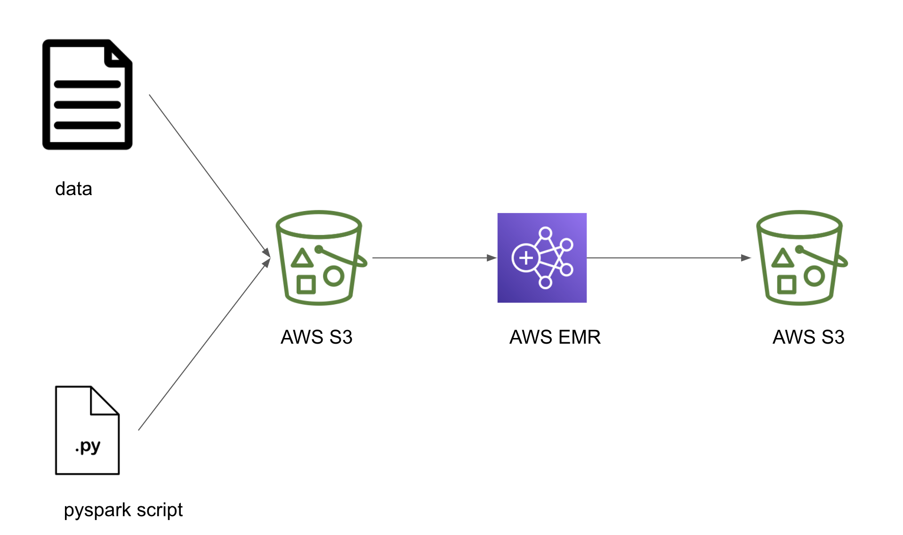
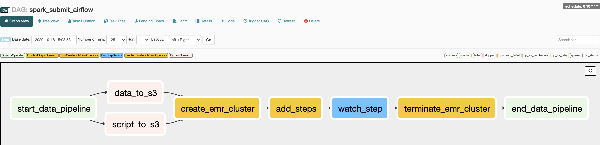

# How to submit Spark jobs to EMR cluster from Airflow

This is the repository for blog at [How to submit Spark jobs to EMR cluster from Airflow](http://startdataengineering.com/post/how-to-submit-spark-jobs-to-emr-cluster-from-airflow).

# Prerequisites

1. [docker](https://docs.docker.com/get-docker/) (make sure to have docker-compose as well).
2. [git](https://git-scm.com/book/en/v2/Getting-Started-Installing-Git) to clone the starter repo.
3. [AWS account](https://aws.amazon.com/) to set up required cloud services.
4. [Install](https://docs.aws.amazon.com/cli/latest/userguide/install-cliv2.html) and [configure](https://docs.aws.amazon.com/cli/latest/userguide/cli-configure-quickstart.html#cli-configure-quickstart-config) AWS CLI on your machine.

# Design



# Data

From the project directory do

```bash
wget https://www.dropbox.com/sh/amdyc6z8744hrl5/AADS8aPTbA-dRAUjvVfjTo2qa/movie_review
mkdir ./dags/data
mv movie_review ./dags/data/movie_review.csv
```

# Setup and run

If this is your first time using AWS, make sure to check for presence of the `EMR_EC2_DefaultRole` and `EMR_DefaultRole` default role as shown below.

```bash
aws iam list-roles | grep 'EMR_DefaultRole\|EMR_EC2_DefaultRole'
# "RoleName": "EMR_DefaultRole",
# "RoleName": "EMR_EC2_DefaultRole",
```

If the roles not present, create them using the following command

```bash
aws emr create-default-roles
```

Also create a bucket, using the following command.

```bash
aws s3api create-bucket --acl public-read-write --bucket <your-bucket-name>
```

Replace `<your-bucket-name>` with your bucket name. eg.) if your bucket name is `my-bucket` then the above command becomes `aws s3api create-bucket --acl public-read-write --bucket my-bucket`

and press `q` to exit the prompt

After use, you can delete your S3 bucket as shown below

```bash
aws s3api delete-bucket --bucket <your-bucket-name>
```

and press `q` to exit the prompt

```bash
docker-compose -f docker-compose-LocalExecutor.yml up -d
```

go to [http://localhost:8080/admin/](http://localhost:8080/admin/) and turn on the `spark_submit_airflow` DAG. You can check the status at [http://localhost:8080/admin/airflow/graph?dag_id=spark_submit_airflow](http://localhost:8080/admin/airflow/graph?dag_id=spark_submit_airflow). 



# Terminate local instance

```bash
docker-compose -f docker-compose-LocalExecutor.yml down
```

```bash
aws s3api delete-bucket --bucket <your-bucket-name>
```

# Contact

website: https://www.startdataengineering.com/

twitter: https://twitter.com/start_data_eng
